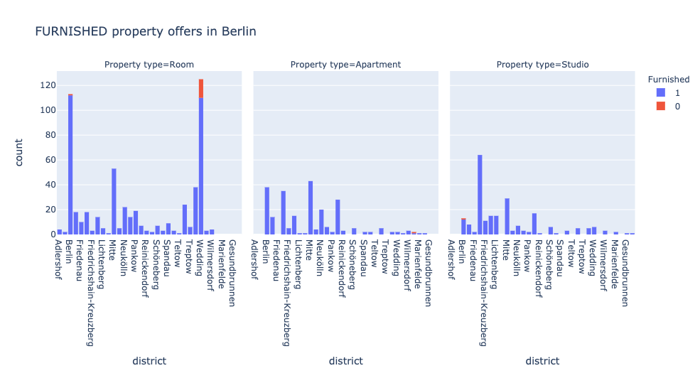
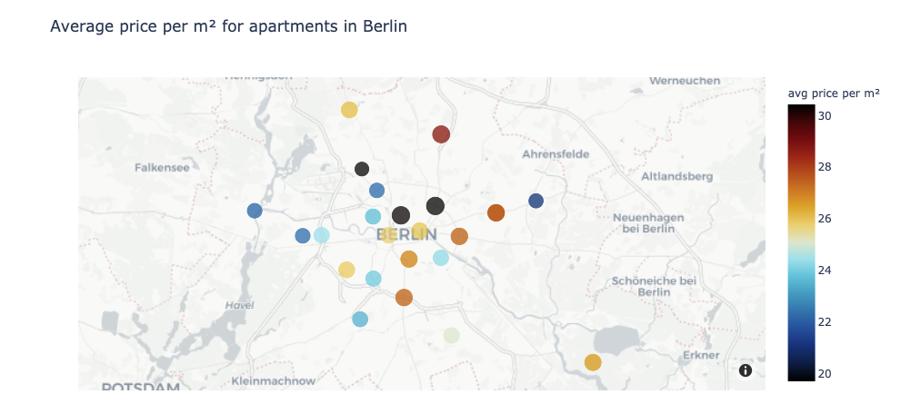
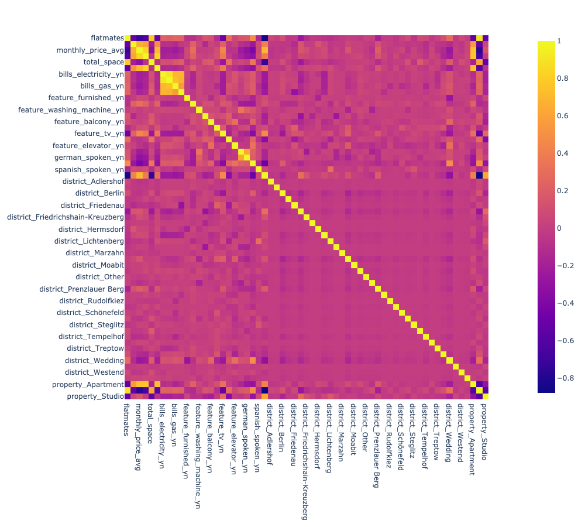

# Property Rent Price Estimation Project
- Creted property rent estimation tool (MAE ˜53 EUR) to help people understand price thresholds in Berlin.
- Scraped 1000 property offers from spotahome.com using python and selenium.
- Engeneered features from text to define what property features and utility bills are included in the offering.
- Optimized Linear and Random Forest Regressors using GridSearchCV to find the best model.
- Client facing API using flask in progress...

## Code and Resources
- __Python Version__ 3.7
- __Packages__: pandas, numpy, plotly, selenium, sklearn
- __Scraper Article__: https://towardsdatascience.com/selenium-tutorial-scraping-glassdoor-com-in-10-minutes-3d0915c6d905
- __Markdown Cheatsheet__: https://github.com/adam-p/markdown-here/wiki/Markdown-Cheatsheet

## Web Scraping
Adjusted the web scraper code to collect the following information about 1000 property offers available in Berlin (Jan 2021).

- Main title
- Property type
- Monthly rent
- Bills
- Property features
- Deposit
- Property rules

## Data Cleaning
Cleaned the data to use for my model. The following changes have been made:

- Cleaned districts in Berlin (37).
- Cleaned property type (3).
- Parced min, max, avg monthly rent price.
- Parced flatmates number.
- Created columns including bills options:
  - Electricity
  - Water
  - Gas
  - WiFi
- Created columns including property features:
  - Furnished
  - Dishwasher
  - Washing mashine
  - Equipped kitchen
  - Balcony
  - Parking
  - TV
  - Oven
  - Elevator
- Parced deposit price.
- Created columns including languages spoken by landlords:
  - English
  - German
  - Russian
  - Spanish
- Created columns for property size, living space per person, if every inhabitant can have an access to 44.6 square metres of living space (german baseline)

## Exploratory Data Analysis
I checked the data distribution, correlation between features, counts categorical variables. Some graphs below. 

  
  
  
